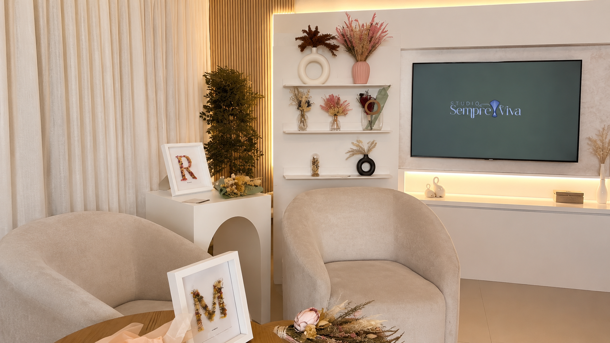

🌸 Studio Sempre Viva

Landing Page desenvolvida para a Studio Sempre Viva, com o objetivo de fortalecer sua presença digital, apresentar seus produtos e facilitar o contato com novos clientes por meio de uma interface moderna, responsiva e intuitiva.

🌐 Site Online

Acesse o projeto publicado:

https://studiosempreviva.com/

📖 Sobre o projeto

Este projeto foi desenvolvido pensando em oferecer uma experiência agradável para os visitantes da floricultura, destacando seus produtos e transmitindo credibilidade através de um design limpo e elegante.

Além da identidade visual, o site foi construído com foco em desempenho, responsividade e facilidade de navegação, permitindo que clientes encontrem rapidamente as informações necessárias e entrem em contato pelo WhatsApp.

✨ Funcionalidades
Landing Page moderna e responsiva
Design adaptado para dispositivos móveis
Apresentação da empresa
Exibição dos produtos
Botão de contato via WhatsApp
Navegação fluida entre as seções
Interface intuitiva
Animações para melhorar a experiência do usuário
Código organizado e de fácil manutenção

🛠️ Tecnologias utilizadas
HTML5
CSS3
JavaScript (Vanilla)
Bootstrap
GSAP
